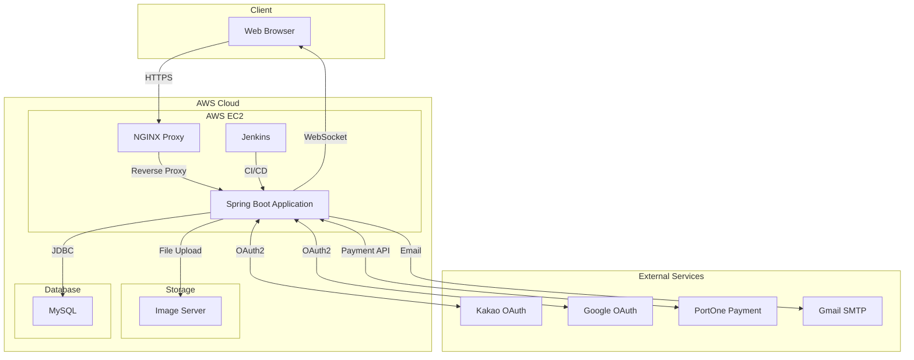

# 🛠 OneStack - IT 전문가 매칭 플랫폼

  

## 📌 프로젝트 소개

OneStack은 IT 전문가와 의뢰인을 연결하는 매칭 플랫폼입니다. 검증된 전문가 풀을 통해 신뢰성 있는 외주 서비스를 제공하며, 실시간 채팅과 프로젝트 관리 기능으로 효율적인 협업을 지원합니다.

### 🎯 핵심 가치
- **신뢰성**: 검증된 전문가 매칭 시스템
- **효율성**: 실시간 소통 및 프로젝트 관리
- **투명성**: 명확한 가격 정책과 리뷰 시스템

## 🛠 기술 스택

### Frontend

### Backend

### Database & Infrastructure

## 💡 주요 기능

### 1. 전문가 매칭 시스템
- 카테고리별 전문가 검색 및 필터링
- 포트폴리오 기반 전문가 프로필
- 견적 요청 및 매칭 시스템

### 2. 실시간 커뮤니케이션
- WebSocket 기반 실시간 채팅
- 프로젝트 진행 상황 공유
- 파일 첨부 및 공유 기능

### 3. 프로젝트 관리
- 일정 관리 캘린더
- 협업 게시판
- 진행 상황 트래킹

### 4. 결제 및 리뷰
- 안전한 결제 시스템 (포트원 연동)
- 프로젝트 완료 후 리뷰 작성
- 전문가 평점 시스템

### 5. 회원 관리
- 전문가 전환 심사
- 회원 정보 접근 및 수정
- 신고 회원 기간정지/영구정지 처리

## 🏗 시스템 아키텍처

## 🚀 배포 환경

- **서버**: AWS EC2 (Ubuntu 20.04 LTS)
- **웹 서버**: NGINX 1.18
- **컨테이너화**: Docker & Docker Compose
- **CI/CD**: Jenkins Pipeline
- **데이터베이스**: MySQL 8.0
- **모니터링**: Spring Actuator

## 🔒 보안 및 인증

- Spring Security 기반 인증
- OAuth2.0 소셜 로그인 (카카오, 구글)
- HTTPS 보안 통신
- 비밀번호 암호화 (BCrypt)

## 👥 팀 구성 및 역할

**이헌복**
- 백엔드 개발 (기여도 60%)
- 프론트엔드 개발 (기여도 50%)
- 서비스 기획 (기여도 80%)

## 📝 라이센스

이 프로젝트는 MIT 라이센스를 따릅니다. 자세한 내용은 [LICENSE](LICENSE) 파일을 참조하세요.

## 🔗 링크

- [서비스 링크](https://www.onestack.store)
- [API 문서](https://api.onestack.store/docs)
